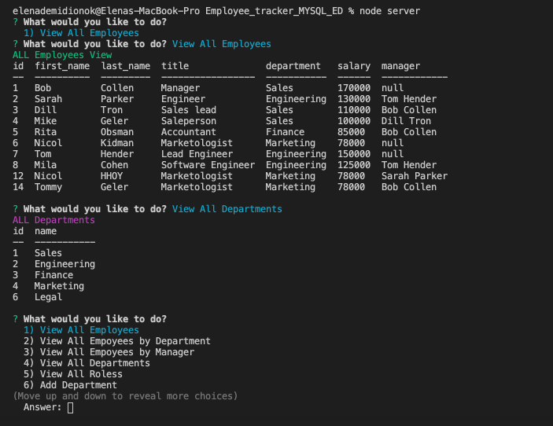

# Employee_tracker_MYSQL_ED
## Overview
This Content Management Systems application has been architected to build a solution for managing a company's employees using node, inquirer, and MySQL.
This app makes it easy for non-developers to view and interact with information stored in databases. 
### To run the application:
 ```sh
$ node server.js
```
> ## This application allows:
> - Add departments, roles, employees
> - View departments, roles, employees
> - Update employee roles
> - View employees by manager
> - Delete departments, roles, and employees
> - View the total utilized budget of a department -- ie the combined salaries of all employees in that department

## Example of working application 
<br>